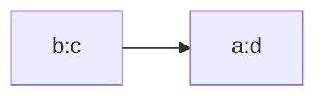
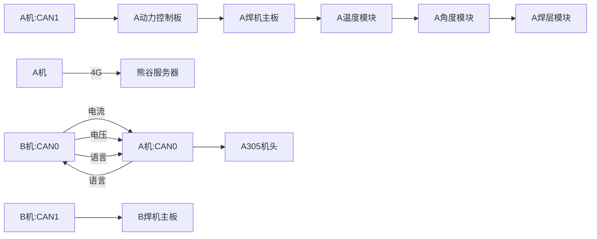
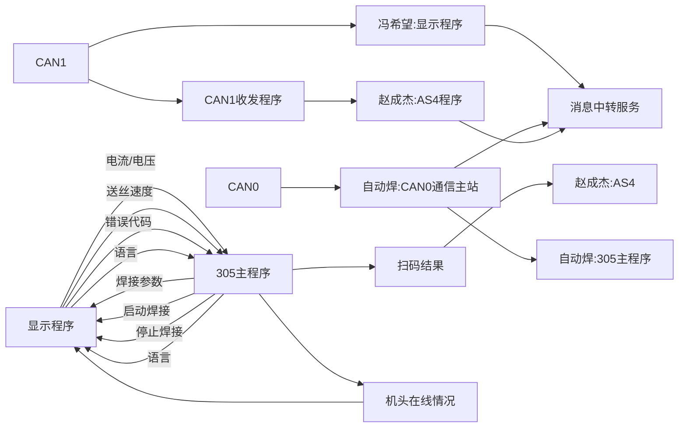
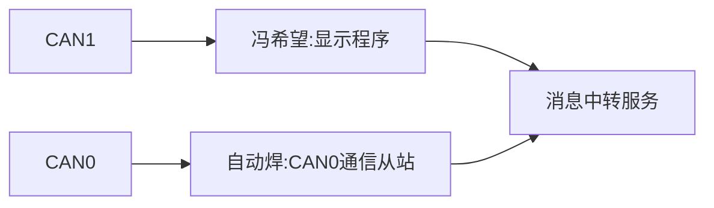

# Study-doc 


this  is  a test ,i use my smart keyboard  write those words from my ipad pro  and this time is 20201114 15:08
# this is a test


asdfasdfasdfasdfas<br/>asdfasgas
换行需要使用 \<br/><br/>否则不对

强调符号在Tab键上方 使用`这`

给一段文字加入超链接的格式是这样的 [ 要显示的文字 ]( 链接的地    "zcj handsome!!!")。比如：
[帅气的zcj](www.sd.com悬停显示)


* *后面有个空格，添加圆点
    * 添加Tab后分级
        * 类似这种 
        * 
        * 
        * 
        
>数据结构  
>>树  
>>>二叉树  
>>>>平衡二叉树  
>>>>>满二叉树  


  
 


[![baidu]](http://baidu.com)  
[baidu]:http://www.baidu.com/img/bdlogo.gif "百度Logo" 


```C
print("hello world\n");
```


一、标题写法：
第一种方法：
1、在文本下面加上 等于号 = ，那么上方的文本就变成了大标题。等于号的个数无限制，但一定要大于0个哦。。
2、在文本下面加上 下划线 - ，那么上方的文本就变成了中标题，同样的 下划线个数无限制。
3、要想输入=号，上面有文本而不让其转化为大标题，则需要在两者之间加一个空行。
另一种方法：（推荐这种方法；注意⚠️中间需要有一个空格）
关于标题还有等级表示法，分为六个等级，显示的文本大小依次减小。不同等级之间是以井号  #  的个数来标识的。一级标题有一个 #，二级标题有两个# ，以此类推。
例如：
# 一级标题  
## 二级标题  
### 三级标题  
#### 四级标题  
##### 五级标题  
###### 六级标题 
二、编辑基本语法  
1、字体格式强调
 我们可以使用下面的方式给我们的文本添加强调的效果
*强调*  (示例：斜体)  
 _强调_  (示例：斜体)  
**加重强调**  (示例：粗体)  
 __加重强调__ (示例：粗体)  
***特别强调*** (示例：粗斜体)  
___特别强调___  (示例：粗斜体)  
2、代码  
`<hello world>`  
3、代码块高亮  
```
@Override
protected void onDestroy() {
    EventBus.getDefault().unregister(this);
    super.onDestroy();
}
```  
4、表格 （建议在表格前空一行，否则可能影响表格无法显示）
 
 表头  | 表头  | 表头
 ---- | ----- | ------  
 单元格内容  | 单元格内容 | 单元格内容 
 单元格内容  | 单元格内容 | 单元格内容  
 
5、其他引用
图片  
  
链接  
[链接名称](https://www.baidu.com/)    
6、列表 
1. 项目1  
2. 项目2  
3. 项目3  
   * 项目1 （一个*号会显示为一个黑点，注意⚠️有空格，否则直接显示为*项目1） 
   * 项目2   
 
7、换行（建议直接在前一行后面补两个空格）
直接回车不能换行，  
可以在上一行文本后面补两个空格，  
这样下一行的文本就换行了。
或者就是在两行文本直接加一个空行。
也能实现换行效果，不过这个行间距有点大。  
 
8、引用
> 第一行引用文字  
> 第二行引用文字


## AB机通信内容



## 设备程序内容

- A机

- B机

