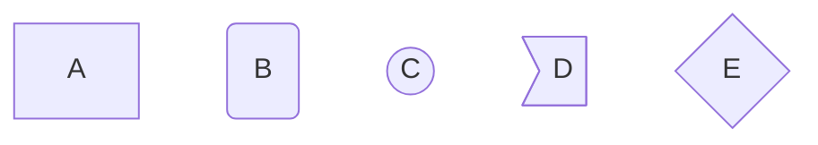
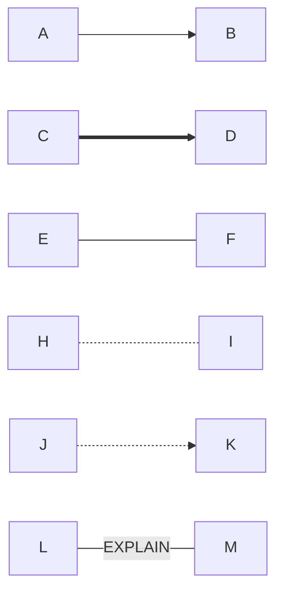
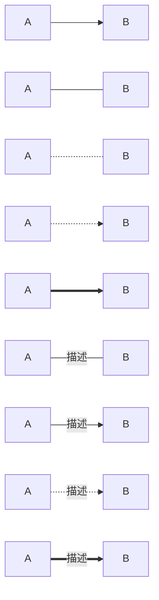

## AB机通信内容


## 设备程序内容

- A机

- B机


# Markdown常用指令集 mermaid指令在GitHub不适用  


## 流程图基本指令

### graph指定是一个图，第二个LR指定图的方向，所有的方向关键词为
```

TB - top bottom
BT - bottom top
RL - right left
LR - left right
TD - same as TB
```
* 之后的A,B,C等都是节点的标识（标识中不能使用空格）

* 节点默认只显示标识,但也可以通过如下方法控制其显示



* 以下是一些常用例程


<br>
<br>


* 还有更多网上的例程如下
此处添加\<br>符号后，后面的指令识别不正确



https://blog.csdn.net/lrnanfayer/article/details/104613690/

* 文字编写等内容


换行需要使用 \<br/><br/>否则不对

强调符号在Tab键上方 使用后`就会变成这样的强调`

给一段文字加入超链接的格式是这样的 [ 要显示的文字 ](链接的地址 "www.zcjhandsome.com")。比如：
[帅气的zcj](www.sd.com悬停显示)


* *后面有个空格，添加圆点
    * 添加Tab后分级
        * 类似这种 
        * 
        * 
        * 
        
>数据结构  
>>树  
>>>二叉树  
>>>>平衡二叉树  
>>>>>满二叉树  

* 图片格式的链接功能


  

  
![baidu]:http://www.baidu.com/img/bdlogo.gif "百度Logo" 


```C
print("hello world\n");
```

* this is  a markdown test
>from handsome zcj

***

***
***
***
***
***

***
<br>
```this single line code to print words```

 表头  | 表头  | 表头
|  :-----: | :-----: | :------:|  
 单元格内容  | 单元格内容 | 单元格内容 
 | ----- | ----- | ------ | 
 单元格内容  | 单元格内容 | 单元格内容  

*这是倾斜测试*<br>

<br>
**这是加粗测试**


转义需要在前面加上\ 比如\<br>

~~请删掉我吧~~


一、标题写法：
第一种方法：
1、在文本下面加上 等于号 = ，那么上方的文本就变成了大标题。等于号的个数无限制，但一定要大于0个哦。。
2、在文本下面加上 下划线 - ，那么上方的文本就变成了中标题，同样的 下划线个数无限制。
3、要想输入=号，上面有文本而不让其转化为大标题，则需要在两者之间加一个空行。
另一种方法：（推荐这种方法；注意⚠️中间需要有一个空格）
关于标题还有等级表示法，分为六个等级，显示的文本大小依次减小。不同等级之间是以井号  #  的个数来标识的。一级标题有一个 #，二级标题有两个# ，以此类推。
例如：
# 一级标题  
## 二级标题  
### 三级标题  
#### 四级标题  
##### 五级标题  
###### 六级标题 
二、编辑基本语法  
1、字体格式强调
 我们可以使用下面的方式给我们的文本添加强调的效果
*强调*  (示例：斜体)  
 _强调_  (示例：斜体)  
**加重强调**  (示例：粗体)  
 __加重强调__ (示例：粗体)  
***特别强调*** (示例：粗斜体)  
___特别强调___  (示例：粗斜体)  
2、代码  
`<hello world>`  
3、代码块高亮  
```
@Override
protected void onDestroy() {
    EventBus.getDefault().unregister(this);
    super.onDestroy();
}
```  
4、表格 （建议在表格前空一行，否则可能影响表格无法显示）
 
 表头  | 表头  | 表头
 ---- | ----- | ------  
 单元格内容  | 单元格内容 | 单元格内容 
 单元格内容  | 单元格内容 | 单元格内容  
 
5、其他引用
* 图片  
  
* 链接  
[链接名称](https://www.baidu.com/)    
6、列表 
1. 项目1  
2. 项目2  
3. 项目3  
   * 项目1 （一个*号会显示为一个黑点，注意⚠️有空格，否则直接显示为*项目1） 
   * 项目2   
 
7、换行（建议直接在前一行后面补两个空格）
直接回车不能换行，  
可以在上一行文本后面补两个空格，  
这样下一行的文本就换行了。
或者就是在两行文本直接加一个空行。
也能实现换行效果，不过这个行间距有点大。  
 
8、引用
> 第一行引用文字  
> 第二行引用文字


