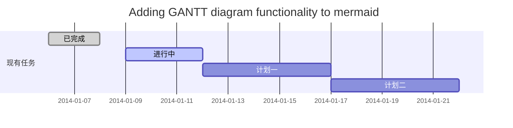
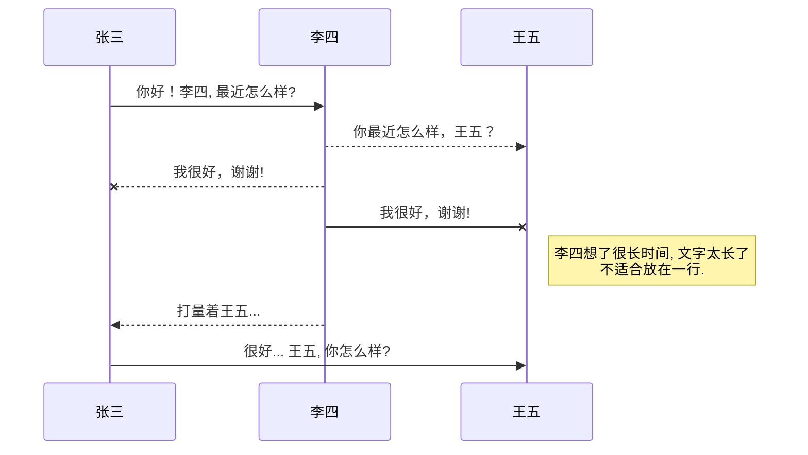

# 树莓派装机流程和部分环境搭建
	raspberryPi setup when u first use it ,and if u r a programmer like me ,u can also set sth compiler environment from here.
##初始化设置

## 设备程序内容

# Markdown常用指令集 mermaid指令在GitHub不适用  

#include "oled.h"
#include "led.h"
//#include "font.h" 
#include "pic.h"
#include "ShowInterface.h"

int main(void)
{		
    Stm32_Clock_Init(9);	//系统时钟设置
//	MY_NVIC_SetVectorTable(NVIC_VectTab_FLASH,ADDR_APP_OFFSET);
	delay_init(72);
    uart_init(72,9600);	
    TIM2_Int_Init(9,7199);
	//CH454_Init();
    CAN_Mode_Init(1,8,7,9,0);
   // TIM3_Int_Init(10-1,8400-1);
    EXTIX_Init();
	SysTask_Create();
    _SEND_GetReady(); 
    LED_Init();
    OLED_Init();
    LCD_Fill(0,0,LCD_W,LCD_H,WHITE);
	LCD_ShowPicture(40,90,240,46,gImage_black);
	delay_ms(65535);  
    LCD_Fill(0,0,LCD_W,LCD_H,WHITE);
	Interface.page = PageMain;
	while(1)
	{
		
	  Timer1_IsrHandler();
	}	
}
```


**加粗**<br> 
*斜体*<br> 
>引用 <br> 
`代码`<br> 
[Internet](www.sb.com "this is a url")<br> 
- 连接<br> 
1. 列表<br> 
- [ 任务列表]<br> 
 

| this is header | is header | block |
| ------:        | :------   | ------ |
| cell           | cell      |
| cell           | cell      |
<br> 


## 流程图基本指令

### graph指定是一个图，第二个LR指定图的方向，所有的方向关键词为

* 之后的A,B,C等都是节点的标识（标识中不能使用空格）

* 节点默认只显示标识,但也可以通过如下方法控制其显示


* 以下是一些常用例程


<br>
<br>


* 还有更多网上的例程如下


https://blog.csdn.net/lrnanfayer/article/details/104613690/

* 文字编写等内容


换行需要使用 \<br/><br/>否则不对

强调符号在Tab键上方 使用后`就会变成这样的强调`

给一段文字加入超链接的格式是这样的 [ 要显示的文字 ](链接的地址 "www.zcjhandsome.com")。比如：
[帅气的zcj](www.sd.com悬停显示)


* *后面有个空格，添加圆点
    * 添加Tab后分级
        * 类似这种 
        * 
        * 
        * 
        
>数据结构  
>>树  
>>>二叉树  
>>>>平衡二叉树  
>>>>>满二叉树  

* 图片格式的链接功能


  

  
![baidu]:http://www.baidu.com/img/bdlogo.gif "百度Logo" 


```C
print("hello world\n");
```
```JAVA
print("hello world\n");
```
* this is  a markdown test
>from handsome zcj

<br>
```this single line code to print words```

 表头  | 表头  | 表头
|  :-----: | :-----: | :------:|  
 单元格内容  | 单元格内容 | 单元格内容 
 | ----- | ----- | ------ | 
 单元格内容  | 单元格内容 | 单元格内容  

*这是倾斜测试*<br>


**这是加粗测试**


转义需要在前面加上\ 比如\<br>

~~请删掉我吧~~


一、标题写法：
第一种方法：
1、在文本下面加上 等于号 = ，那么上方的文本就变成了大标题。等于号的个数无限制，但一定要大于0个哦。。
2、在文本下面加上 下划线 - ，那么上方的文本就变成了中标题，同样的 下划线个数无限制。
3、要想输入=号，上面有文本而不让其转化为大标题，则需要在两者之间加一个空行。
另一种方法：（推荐这种方法；注意⚠️中间需要有一个空格）
关于标题还有等级表示法，分为六个等级，显示的文本大小依次减小。不同等级之间是以井号  #  的个数来标识的。一级标题有一个 #，二级标题有两个# ，以此类推。
例如：
# 一级标题  
## 二级标题  
### 三级标题  
#### 四级标题  
##### 五级标题  
###### 六级标题 
二、编辑基本语法  
1、字体格式强调
 我们可以使用下面的方式给我们的文本添加强调的效果
*强调*  (示例：斜体)  
 _强调_  (示例：斜体)  
**加重强调**  (示例：粗体)  
 __加重强调__ (示例：粗体)  
***特别强调*** (示例：粗斜体)  
___特别强调___  (示例：粗斜体)  
2、代码  
`<hello world>`  
3、代码块高亮  
```
@Override
protected void onDestroy() {
    EventBus.getDefault().unregister(this);
    super.onDestroy();
}
```  
4、表格 （建议在表格前空一行，否则可能影响表格无法显示）
 
 表头  | 表头  | 表头
 ---- | ----- | ------  
 单元格内容  | 单元格内容 | 单元格内容 
 单元格内容  | 单元格内容 | 单元格内容  
 
5、其他引用
* 图片  
  
* 链接  
[链接名称](https://www.baidu.com/)    
6、列表 
1. 项目1  
2. 项目2  
3. 项目3  
   * 项目1 （一个*号会显示为一个黑点，注意⚠️有空格，否则直接显示为*项目1） 
   * 项目2   
 
7、换行（建议直接在前一行后面补两个空格）
直接回车不能换行，  
可以在上一行文本后面补两个空格，  
这样下一行的文本就换行了。
或者就是在两行文本直接加一个空行。
也能实现换行效果，不过这个行间距有点大。  
 
8、引用
> 第一行引用文字  
> 第二行引用文字

@[TOC](这里写自定义目录标题)

# 欢迎使用Markdown编辑器

你好！ 这是你第一次使用 **Markdown编辑器** 所展示的欢迎页。如果你想学习如何使用Markdown编辑器, 可以仔细阅读这篇文章，了解一下Markdown的基本语法知识。

## 新的改变

我们对Markdown编辑器进行了一些功能拓展与语法支持，除了标准的Markdown编辑器功能，我们增加了如下几点新功能，帮助你用它写博客：
 1. **全新的界面设计** ，将会带来全新的写作体验；
 2. 在创作中心设置你喜爱的代码高亮样式，Markdown **将代码片显示选择的高亮样式** 进行展示；
 3. 增加了 **图片拖拽** 功能，你可以将本地的图片直接拖拽到编辑区域直接展示；
 4. 全新的 **KaTeX数学公式** 语法；
 5. 增加了支持**甘特图的mermaid语法[^1]** 功能；
 6. 增加了 **多屏幕编辑** Markdown文章功能；
 7. 增加了 **焦点写作模式、预览模式、简洁写作模式、左右区域同步滚轮设置** 等功能，功能按钮位于编辑区域与预览区域中间；
 8. 增加了 **检查列表** 功能。
 [^1]: [mermaid语法说明](https://mermaidjs.github.io/)

## 功能快捷键

撤销：<kbd>Ctrl/Command</kbd> + <kbd>Z</kbd>
重做：<kbd>Ctrl/Command</kbd> + <kbd>Y</kbd>
加粗：<kbd>Ctrl/Command</kbd> + <kbd>B</kbd>
斜体：<kbd>Ctrl/Command</kbd> + <kbd>I</kbd>
标题：<kbd>Ctrl/Command</kbd> + <kbd>Shift</kbd> + <kbd>H</kbd>
无序列表：<kbd>Ctrl/Command</kbd> + <kbd>Shift</kbd> + <kbd>U</kbd>
有序列表：<kbd>Ctrl/Command</kbd> + <kbd>Shift</kbd> + <kbd>O</kbd>
检查列表：<kbd>Ctrl/Command</kbd> + <kbd>Shift</kbd> + <kbd>C</kbd>
插入代码：<kbd>Ctrl/Command</kbd> + <kbd>Shift</kbd> + <kbd>K</kbd>
插入链接：<kbd>Ctrl/Command</kbd> + <kbd>Shift</kbd> + <kbd>L</kbd>
插入图片：<kbd>Ctrl/Command</kbd> + <kbd>Shift</kbd> + <kbd>G</kbd>
查找：<kbd>Ctrl/Command</kbd> + <kbd>F</kbd>
替换：<kbd>Ctrl/Command</kbd> + <kbd>G</kbd>

## 合理的创建标题，有助于目录的生成

直接输入1次<kbd>#</kbd>，并按下<kbd>space</kbd>后，将生成1级标题。
输入2次<kbd>#</kbd>，并按下<kbd>space</kbd>后，将生成2级标题。
以此类推，我们支持6级标题。有助于使用`TOC`语法后生成一个完美的目录。

## 如何改变文本的样式

*强调文本* _强调文本_

**加粗文本** __加粗文本__

==标记文本==

~~删除文本~~

> 引用文本

H~2~O is是液体。

2^10^ 运算结果是 1024.

## 插入链接与图片

链接: [link](https://www.csdn.net/).

图片: 

带尺寸的图片: 

居中的图片: 

居中并且带尺寸的图片: 

当然，我们为了让用户更加便捷，我们增加了图片拖拽功能。

## 如何插入一段漂亮的代码片

去[博客设置](https://mp.csdn.net/console/configBlog)页面，选择一款你喜欢的代码片高亮样式，下面展示同样高亮的 `代码片`.
```javascript
// An highlighted block
var foo = 'bar';
```

## 生成一个适合你的列表

- 项目
  - 项目
    - 项目

1. 项目1
2. 项目2
3. 项目3

- [ ] 计划任务
- [x] 完成任务

## 创建一个表格
一个简单的表格是这么创建的：
项目     | Value
-------- | -----
电脑  | $1600
手机  | $12
导管  | $1

### 设定内容居中、居左、居右
使用`:---------:`居中
使用`:----------`居左
使用`----------:`居右
| 第一列       | 第二列         | 第三列        |
|:-----------:| -------------:|:-------------|
| 第一列文本居中 | 第二列文本居右  | 第三列文本居左 |

### SmartyPants
SmartyPants将ASCII标点字符转换为“智能”印刷标点HTML实体。例如：
|    TYPE   |ASCII                          |HTML
|----------------|-------------------------------|-----------------------------|
|Single backticks|`'Isn't this fun?'`            |'Isn't this fun?'            |
|Quotes          |`"Isn't this fun?"`            |"Isn't this fun?"            |
|Dashes          |`-- is en-dash, --- is em-dash`|-- is en-dash, --- is em-dash|

## 创建一个自定义列表
Markdown
:  Text-to-HTML conversion tool

Authors
:  John
:  Luke

## 如何创建一个注脚

一个具有注脚的文本。[^2]

[^2]: 注脚的解释

##  注释也是必不可少的

Markdown将文本转换为 HTML。

*[HTML]:   超文本标记语言

## KaTeX数学公式

您可以使用渲染LaTeX数学表达式 [KaTeX](https://khan.github.io/KaTeX/):

Gamma公式展示 $\Gamma(n) = (n-1)!\quad\forall
n\in\mathbb N$ 是通过欧拉积分

$$
\Gamma(z) = \int_0^\infty t^{z-1}e^{-t}dt\,.
$$

> 你可以找到更多关于的信息 **LaTeX** 数学表达式[here][1].

## 新的甘特图功能，丰富你的文章


- 关于 **甘特图** 语法，参考 [这儿][2],

## UML 图表

可以使用UML图表进行渲染。 [Mermaid](https://mermaidjs.github.io/). 例如下面产生的一个序列图：



这将产生一个流程图。:

- 关于 **Mermaid** 语法，参考 [这儿][3],

## FLowchart流程图


- 关于 **Flowchart流程图** 语法，参考 [这儿][4].

## 导出与导入

###  导出
如果你想尝试使用此编辑器, 你可以在此篇文章任意编辑。当你完成了一篇文章的写作, 在上方工具栏找到 **文章导出** ，生成一个.md文件或者.html文件进行本地保存。

### 导入
如果你想加载一篇你写过的.md文件，在上方工具栏可以选择导入功能进行对应扩展名的文件导入，
继续你的创作。

 [1]: http://meta.math.stackexchange.com/questions/5020/mathjax-basic-tutorial-and-quick-reference
 [2]: https://mermaidjs.github.io/
 [3]: https://mermaidjs.github.io/
 [4]: http://adrai.github.io/flowchart.js/

